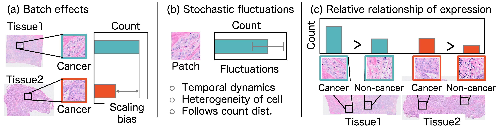

# Learning to Relative Expression under Batch Effects and Stochastic Noise in Spatial Transcriptomics
This repository is the official implementation of [Learning to Relative Expression under Batch Effects and Stochastic Noise in Spatial Transcriptomics]
<!-- (https://arxiv.org/abs/2030.12345).  -->



## Requirements

- pytorch
- doten

## Training and evaluation on synthetic data
To train the model(s) in the paper, run this command:

```train and evaluation
cd toy_example
bash ./scripts/run_comparisons.sh
```

## Training and evaluation on real dataset
Data preparation:
Our experimetns used [HEST-1k](https://github.com/mahmoodlab/HEST/tree/main) dataset. Before execute our experiments, you should get permittion. 

Execute all experiments

```eval
python ./scripts/execute_all_exps.py
```

## Separately running code

```
# download dataset
# Put HEST_v1_1_0.csv file into dataset/hest1k/ 

# another examples
python ./preprocessing/download_hest_benchmarks.py st_v2
python ./preprocessing/download_hest_benchmarks.py task_1
python ./preprocessing/download_hest_benchmarks.py st_v3
```

# preprocessing
```
python ./preprocessing/make_paired.py ./dataset/hest1k/task_1
python ./preprocessing/feature_extraction.py --model_name conch_v1 \
    --save_dir ./dataset/hest1k/task_1/feat/conch_v1 \
    --input_dir ./dataset/hest1k/task_1/paired_data

python ./scripts/export_highly_variable.py \
    --data_dir ./dataset/hest1k/task_1/feat/conch_v1 \
    --output_path ./dataset/hest1k/task_1/opts/comp/highly_variable_genes_50.txt \
    --ntop_genes 50
```

# run benchmark
```
python ./strank/train.py \
        --data_dir  ./dataset/hest1k/task_1/feat/conch_v1\
        --param_path ./dataset/hest1k/task_1/opts/comp/stranklist/opt_param.pt \
        --test_sample_ids NCBI783  \
        --val_sample_ids TENX95 \
        --log_dir ./dataset/hest1k/task_1/opts/comp/logs \
        --loss stranklist \
        --model linear \
        --max_epochs 1000 \
        --use_gene ./dataset/hest1k/task_1/opts/comp/highly_variable_genes.txt \
        --ngpu 1

python ./strank/evaluation.py \
        --data_dir ./dataset/hest1k/task_1/feat/conch_v1\
        --param_path ./dataset/hest1k/task_1/opts/comp/stranklist/opt_param.pt \
        --sample_ids NCBI783  \
        --model linear \
        --loss stranklist \
        --batch_size 1024 \
        --use_gene ./dataset/hest1k/task_1/opts/comp/highly_variable_genes.txt \
        --output_csv {save_path}
```


## Results

Our model achieves the following performance on :


**Table: Real dataset from Hest 1k. Bold = best performance, Underline = second-best. Ave. = average performance.**

|           | Loss        | IDC   | PRAD  | PAAD  | COAD  | READ  | ccRCC | IDC-L | Ave.  |
|-----------|-------------|-------|-------|-------|-------|--------|--------|--------|--------|
| **Point** | MSE         | 0.393 | 0.484 | 0.307 | 0.556 | 0.140 | 0.093 | 0.168 | 0.306 |
|           | Po          | 0.314 | _0.485_ | 0.336 | 0.524 | **0.172** | 0.091 | 0.134 | 0.293 |
|           | NB          | 0.199 | **0.491** | 0.119 | 0.538 | _0.160_ | 0.075 | 0.126 | 0.244 |
| **Pair**  | Rank        | 0.317 | 0.317 | 0.181 | 0.566 | 0.047 | 0.059 | 0.110 | 0.228 |
|           | PairSTrank  | _0.494_ | 0.458 | **0.346** | _0.613_ | 0.136 | **0.127** | _0.228_ | _0.343_ |
| **List**  | PCC         | 0.472 | 0.459 | 0.307 | **0.640** | 0.105 | 0.102 | 0.198 | 0.326 |
|           | ListSTrank  | **0.510** | 0.459 | _0.343_ | 0.597 | 0.140 | _0.125_ | **0.238** | **0.345** |


<!-- ## Contributing -->


## Acknowledgement
- We used [HEST-1k](https://github.com/mahmoodlab/HEST) dataset.
- For the feature extractor, we implemented the code based on [CLAM](https://github.com/mahmoodlab/CLAM).


## Citation

If you use the code or results in this repository, please cite our paper:

```bibtex
@article{kazuya2025learning,
  title={Learning Relative Gene Expression Trends
under Batch Effects and Stochastic Noise
in Spatial Transcriptomics},
  author={Kazuya Nishimura, , Haruka Hirose, Ryoma Bise, Kaito Shiku, Yasuhiro Kojima},
  journal={Neurips},
  year={2025}
}
```

## License

This repository is licensed under the MIT License. See the [LICENSE](LICENSE) file for more details.
